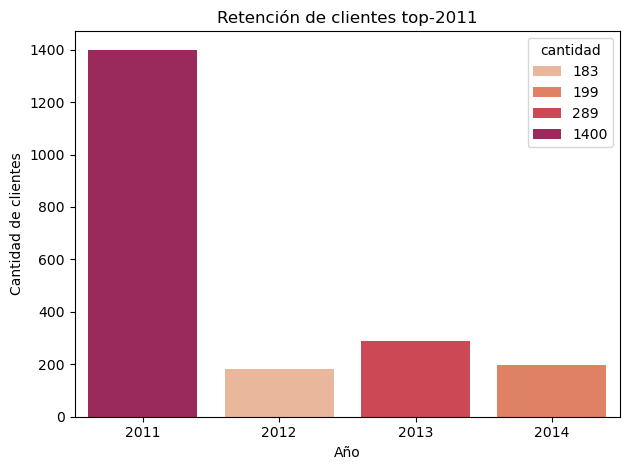
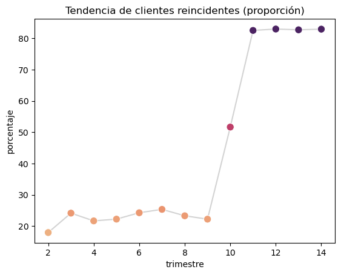
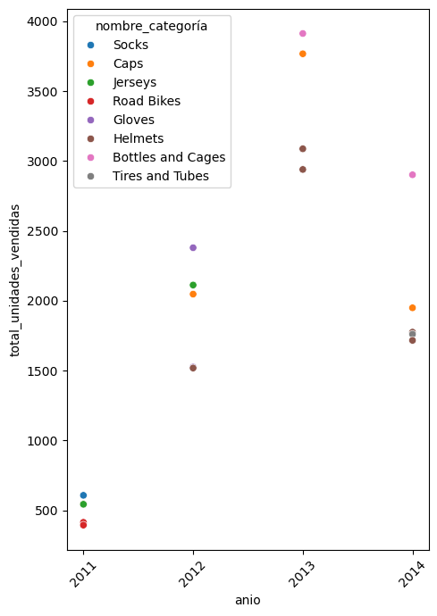
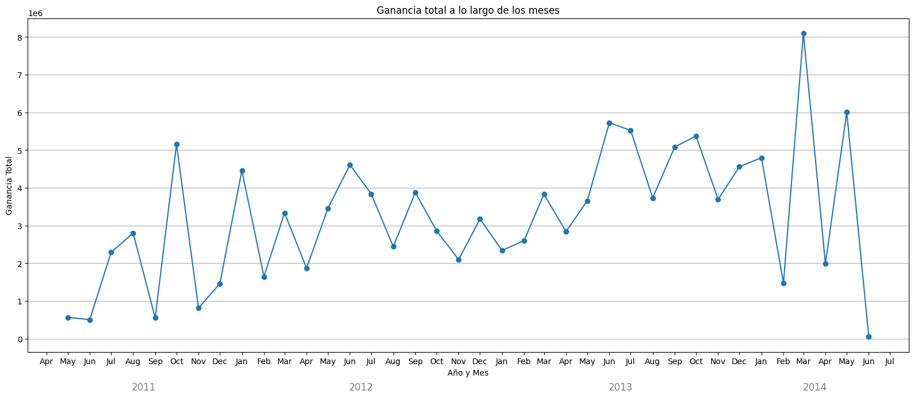
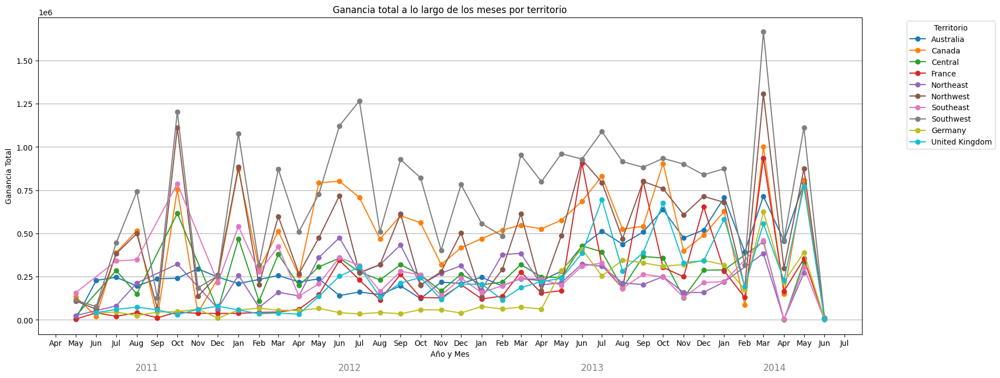

# sql-python-cohort-retention

El presente proyecto fue realizado en el contexto de la matería "Modelos Relacionales" de la Maestría en Ciencia de Datos de la Universidad de Buenos Aires.
Este trabajo tiene como objetivo realizar análisis de retención y reincidencia de cohortes y estudios
de tendencias por periodos temporales. Este trabajo es realizado en la base de datos
AdventureWorks2019, a tales efectos se utiliza Python en conjunto con la librería PYODBC para realizar
consultas SQL y obtener los datos que servirán como base para la creación de gráficos con la asistencia
de PANDAS, SEABORN y MATPLOTLIB.

El análisis se centra en dos dimensiones principales: clientes y productos. Ambas dimensiones
analizadas en relación a las ventas. De esta manera el esquema Sales será el más utilizado con sus
tablas Sales.SalesOrderHeader y Sales.SalesOrderDetail. Sin embargo excepcionalmente cuando el
análisis lo requiera se pueden incluir otro tipo de tablas del esquema Production para enfocarnos en sí
determinada tendencia responde a la naturaleza del producto ofrecido.

El análisis comienza por un análisis de tendencias temporales de las ganancias obtenidas por la empresa
(Figura 1). Se observa un salto significativo en el año 2013 alcanzando un monto de 48 millones de
dolares. Esto nos sirvió para pensar una pregunta de si había alguna causalidad en dicho incremento o
era producto del azar.

  

Es por ello que buscamos analizar si la tendencia de crecimiento resultaba atribuible a algún territorio en
particular donde la empresa registrara actividad o era una tendencia sistemática en todos. Partiendo de
la siguiente visualización (Figura 2) observamos que la tendencia es general en cada uno de los
territorios donde la compañía desarrolla actividades motivo por el cual el territorio no sería (en principio)
un factor determinante del aumento en las ganancias registradas en el año 2013.

  

De esta manera surge el interrogante si será un factor determinante el comportamiento de los clientes o
es atribuible a los productos ofrecidos el aumento en las ganancias del año 2013. 

Es por ello que se
precede en primer lugar a verificar si ese impacto en las ganancias también es observable en los
clientes lo cual conforme surge de la imagen (Figura 3) se ratifica una tendencia significativa de
aumento en la clientela del año 2013.

  

Partiendo de este análisis, nos proponemos comprender con mayor profundidad la composición del
grupo de clientes del año 2013. En particular, buscamos determinar si este incremento responde a la
captación de nuevos clientes —posiblemente impulsada por un cambio en el catálogo de productos— o
si también incluye el regreso de clientes previos, lo cual implicaría cierta fidelidad o reactivación del
vínculo con la compañía.

En los datos (Figura 4) se revela que muchos de los clientes que habían estado activos en 2011 dejaron
de realizar compras en 2012, pero volvieron a hacerlo en 2013. Este comportamiento sugiere que el
aumento observado podría estar motivado por cambios en la oferta de productos o en la estrategia
comercial de la compañía, pero para ello se requiere un análisis más detallado del comportamiento de
las cohortes.

  

Con motivo de este indicio se procedió al análisis de cohortes con una granularidad más fina. Buscando
traducir a porcentajes, las cantidades de clientes que se conservaban de las cohortes originales. Ya no
centrándonos sólo en el año 2011 sino en los clientes que tuvieron contacto por primera vez en la
compañía en los sucesivos años. 

De esta manera conforme podemos observar en el gráfico de líneas
(Figura 5), tanto para las cohortes del año 2011 como 2012 se puede observar una retención que en
ambos gira en valores en el rango de entre el 50 y 55 por ciento para el año 2013. Resulta llamativo el
hecho de que el año 2013 refleja un retorno significativo de los clientes del año 2011.

  

Se ajusta nuevamente la granularidad para realizar un análisis trimestral. Se puede observar (Figura 6)
que para el primer trimestre del 2013 comienza la tendencia de crecimiento con un retorno de los
clientes de los productos ofrecidos en los trimestres anteriores al segundo trimestre de 2013. Se
configura de esta manera una curva con inflexión hacia arriba también llamada “curva” sonrisa.

Asimismo, se observa un punto de quiebre reflejado en el cambio del comportamiento de los cohortes
de retención en el segundo trimestre de 2013 (trimestre 10). Por un lado, en este trimestre la caída de la
retención en el mes subsiguiente al que los productos fueron comprados (hecho que está presente en
todas las cohortes) es significativamente menor y por otro lado, es el punto de inflexión a partir del cuál
todas las cohortes siguientes registran las caídas más grandes. Por ende es correcto inferir que hay
productos ofrecidos en el décimo trimestre de análisis que produjeron un cambio en el comportamiento
de consumo de los clientes.

  

En esta visualización (Figura 7) se realiza un análisis de cohortes centrado en la reincidencia de
aquellos clientes que hagan más de una compra. Se corrobora el presunto cambio en el
comportamiento de los clientes analizado previamente (Figura 6) en el trimestre 11 pues ese cambio en
el presente gráfico (Figura 7) también se refleja en un aumento de la reincidencia de los clientes,
llegando a valores superiores al 80%. Un cambio significativo en comparación con los valores de
reincidencia cercanos al 20% mantenidos hasta el trimestre 10. Es a partir de ello que procedemos al
análisis de los productos vendidos a los efectos poder descubrir la causa de ese cambio.

  

Procedemos con idéntica metodología (a la utilizada en las Figuras 4, 5 y 6) a analizar (Figura 7) la
retención de productos de los originalmente comprados en el año 2011. A partir de esto podemos a
priori inferir un cambio significativo en el año 2013 que indicaría que sólo 11 de los productos
comprados en el 2011 fueron comprados en el 2013. De esta forma resulta indicado proceder a un
análisis más detallado.

  

El comportamiento observado en los productos del año 2011 será ratificado también en el año 2012
(Figura 9), registrando ambos un pérdida de retención de productos de 20 y 40 por ciento
respectivamente. Sin embargo para detectar el punto de inflexión concreto resulta determinante analizar
la retención en cohortes trimestrales

  

Finalmente se procede a hacer un análisis con granularidad más fina y se corrobora este
comportamiento alrededor del año 2013 haciendo un análisis de múltiples cohortes trimestrales de
productos (FIGURA 10) demostrando que para todas las cohortes pertenecientes a los diferentes
trimestres del año 2011 y 2012 el punto de inflexión se genera en el tercer trimestre del año 2013, es
decir desde el trimestre número 11. 

Se visualizan pérdidas de retención de aproximadamente el 40% de
productos para dichas cohortes en contraposición a las cohortes pertenecientes a todos los trimestres
posteriores al segundo trimestre del 2013 pues en ellos la alta retención indica un presunto cambio en el
comportamiento de los clientes que parecieran preferir el consumo de los productos solicitados en este
periodo.

  

Para facilitar la lectura de valores se procedió a realizar un gráfico heat-map de cohortes en el cual
facilita la lectura de valores que presenta la figura 11.

  

Así teniendo en consideración lo visualizado, en el gráfico (Figura 12) no resulta casual que los 5
productos más vendidos los 5 hayan comenzado a venderse en mayo de 2013 y que de manera
congruente con el análisis realizado hasta este punto estos productos superen ampliamente a los
productos vendidos en el 2011 y 2022.

Estos productos son: “Water Bottle - 30 oz” (categoría Bottles
and Cages), “AWC Logo Cap” (categoría “Caps”), “Sport-100 Helmet, Black” (categoría Helmets),
“Sport-100 Helmet, Blue” (categoría Helmets) y “Sport-100 Helmet, Red” (categoría Helmets).

  

De forma congruente, este aumento en las ventas se reflejó también en un aumento en la ganancia
(FIGURA 13) alcanzando un punto de inflexión con la salida a la venta de los 5 productos más
vendidos.

  

Finalmente se ratifica (FIGURA 14) que ese aumento en las ganancias por aumento de ventas no
correspondía a un territorio en específico sino que está presente en todos los territorios donde la
compañía desarrolla actividades.

  

Conclusión
En la base de datos Adventure Work analizando el comportamiento de retención de múltiples cohortes
con diferente granularidad encontramos evidencia suficiente como para mantener que el negocio
registró un cambio considerable en sus ganancias a partir de la inclusión en el segundo trimestre del
año 2013 de nuevos productos que produjeron un cambio significativo en la cantidad de ventas
impactando de manera positiva en las ganancias de la compañía y en el comportamiento de los clientes
haciendo que los mismos fuesen más propensos a la reincidencia, registrando de esta manera más de
una compra por trimestre por cliente y propiciando el regreso de antiguos clientes. Esto también facilitó
también el aumento de ventas de productos de catálogo vendidos en trimestres anteriores.

